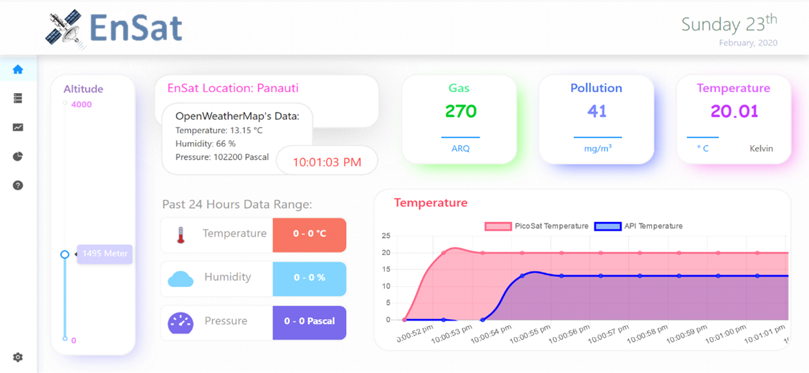

PicoSat is a miniature version of an Environmental Satellite which helps to record and analyze the environmental parameters as altitude, pressure, temperature, humidity and pollution level.

This was our fifth semester college project where I worked on data transfer from the satellite to computer, database setup and management and GUI for data visualization. Serialport package for data communication, MongoDB for database and React was used for the GUI.

Project Screenshots:

 
Hardware:

.jpg)

.jpg)

.jpg)
